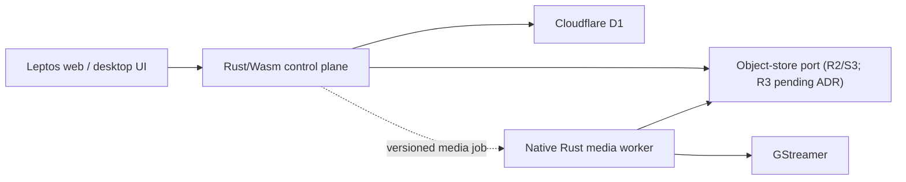

# Frame

Frame is a Rust migration scaffold for [Cap](https://github.com/CapSoftware/Cap): native media processing with GStreamer, an edge control plane backed by Cloudflare D1 and object storage, and Leptos user interfaces.

This repository starts with boundaries and executable seams, not copied Cap source. The reference checkout lives in ignored `.tmp/cap` at commit `6ba69561ac86b8efdb17616d6727f9638015546b`. See [docs/upstream-cap.md](docs/upstream-cap.md) and the dependency-ordered [_issues backlog](_issues/README.md).

## Architecture



The split is intentional: D1 and Cloudflare object bindings run in Workers/Wasm, while GStreamer requires a native desktop or container runtime. Shared Rust types keep the API, UI, and workers aligned without pretending those environments are interchangeable.

## Repository layout

- `apps/control-plane`: Cloudflare Worker using real D1 and object-store bindings.
- `apps/media-worker`: native executable that probes GStreamer and can produce a synthetic WebM smoke artifact.
- `apps/web`: server-rendered Leptos shell served by Axum.
- `crates/domain`: IDs, recording state, object keys, and transition rules.
- `crates/media`: GStreamer pipeline construction and runtime checks.
- `crates/ports`: repository and object-store contracts with in-memory adapters.
- `apps/control-plane/migrations`: D1/SQLite migrations.
- `_issues`: the migration program, ordered by phase and dependency.

## Quick start

Prerequisites are Rust 1.96.1 and GStreamer with the base/good plugin sets. On macOS, `brew install gstreamer` supplies the development runtime. Then run:

```sh
cargo test --workspace
cargo run -p frame-media-worker -- probe
cargo run -p frame-media-worker -- smoke target/frame-smoke.webm
cargo run -p frame-web
```

The web shell listens on `FRAME_ADDR` or `127.0.0.1:3000`. The control-plane Worker is checked separately because it targets `wasm32-unknown-unknown`:

```sh
cargo check -p frame-control-plane --target wasm32-unknown-unknown
```

Before running Wrangler, create the D1 database and object bucket, replace the placeholder IDs in `apps/control-plane/wrangler.toml`, and apply the migrations.

## About “R3”

The requested target says “R3,” but Cloudflare's documented object-storage product is R2. Frame therefore keeps storage behind a provider-neutral port, scaffolds an R2 binding as the working hypothesis, and blocks storage commitment on [_issues/02-p0-resolve-r3-storage-target.md](_issues/02-p0-resolve-r3-storage-target.md). This also prevents accidentally dropping Cap's existing S3-compatible and Google Drive options.
