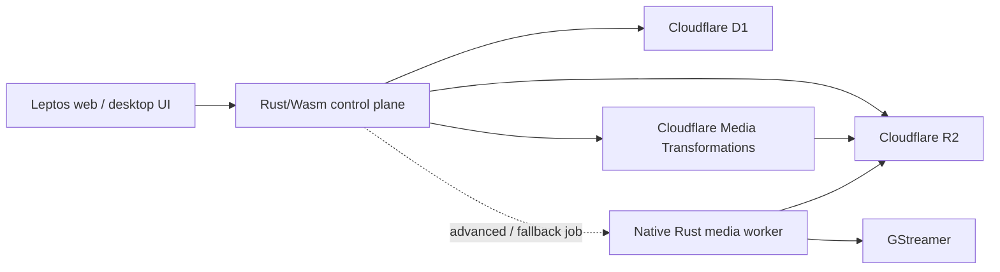

# Frame

Frame is a Rust migration scaffold for [Cap](https://github.com/CapSoftware/Cap): native media processing with GStreamer, an edge control plane backed by Cloudflare D1, R2, and Media Transformations, and Leptos user interfaces. Its public distribution target is `frame.engmanager.xyz`, with the Leptos web origin on Render and `/api/*` routed by Cloudflare to the Worker control plane.

This repository starts with boundaries and executable seams, not copied upstream source. The Cap reference checkout lives in ignored `.tmp/cap` at commit `6ba69561ac86b8efdb17616d6727f9638015546b`; the EngManager portfolio reference lives in ignored `.tmp/engmanager.xyz` at commit `1de52bc8f25793dea3697e67765d53785c05cdfa`. See [the Cap inventory](docs/upstream-cap.md), [the portfolio integration inventory](docs/upstream-engmanager.md), and the dependency-ordered [_issues backlog](_issues/README.md).

## Architecture



The split is intentional. D1, R2, and Cloudflare Media Transformations run at the Worker boundary. Media Transformations handles supported R2-native derivatives such as short optimized MP4 clips, still frames, spritesheets, and audio extraction. GStreamer remains the native engine for capture, synchronization, editing/export, long-form or complex processing, unsupported codecs, and fallback. Shared Rust types keep the API, UI, and workers aligned without pretending those environments are interchangeable.

The public-host split is equally explicit: Cloudflare proxies normal
`frame.engmanager.xyz` page/asset traffic to a dedicated Render `frame-web`
service and uses a query-safe broad Worker Route with strict path validation to
intercept `/api` plus `/api/*`. Frame does not run inside the existing
`engmanager.xyz` portfolio process. The portfolio first
integrates through top-level navigation, not shared cookies or an embedded
recorder. [ADR 0004](docs/adr/0004-engmanager-render-cloudflare-topology.md)
records the decision; issues [36–44](_issues/README.md#issue-index) specify the
client crate, portfolio work, Render Blueprint, GitHub Actions, Cloudflare
infrastructure, browser security, E2E, and launch.

## Repository layout

- `apps/control-plane`: Cloudflare Worker configured with D1, R2, and Media Transformations bindings.
- `apps/media-worker`: native executable that probes GStreamer and can produce a synthetic WebM smoke artifact.
- `apps/web`: server-rendered Leptos shell served by Axum.
- `crates/domain`: IDs, recording state, object keys, and transition rules.
- `crates/media`: GStreamer pipeline construction and runtime checks.
- `crates/ports`: repository, object-store, and media-transform contracts with deterministic in-memory adapters.
- `apps/control-plane/migrations`: D1/SQLite migrations.
- `_issues`: the migration program, ordered by phase and dependency.

## Quick start

Prerequisites are Rust 1.96.1 and GStreamer with the base/good plugin sets. On macOS, `brew install gstreamer` supplies the development runtime. Then run:

```sh
cargo test --workspace
cargo run -p frame-media-worker -- probe
cargo run -p frame-media-worker -- smoke target/frame-smoke.webm
cargo run -p frame-web
```

The web shell listens on `FRAME_ADDR` or `127.0.0.1:3000`. The control-plane Worker is checked separately because it targets `wasm32-unknown-unknown`:

```sh
cargo check -p frame-control-plane --target wasm32-unknown-unknown
```

Before running Wrangler, install `worker-build`, create the D1 database and R2 buckets, replace the placeholder IDs in `apps/control-plane/wrangler.toml`, enable the Media Transformations binding for the account, and apply the migrations. Cloudflare currently requires remote development for the Media binding, so normal local tests use the media port/fake and a dedicated remote lane exercises the real binding.

## Cloudflare media split

Cloudflare R2 is the confirmed canonical object store. [ADR 0002](docs/adr/0002-cloudflare-r2-storage.md) records that decision while keeping a provider-neutral port for tests and any approved self-hosted or bring-your-own-storage compatibility. [Issue 02](_issues/02-p0-establish-r2-storage-target.md) owns the remaining compatibility decisions rather than reopening provider selection.

The configured `MEDIA` binding is [Cloudflare Media Transformations](https://developers.cloudflare.com/stream/transform-videos/bindings/), which transforms private R2 inputs and can stream immutable outputs back to R2. It is distinct from the [`STREAM` managed video-library binding](https://developers.cloudflare.com/stream/manage-video-library/bindings/); Frame does not enable `[stream]` upload/library/adaptive-playback semantics without a separate product decision. [ADR 0003](docs/adr/0003-cloudflare-media-transformations.md) and issues [03](_issues/03-p0-runtime-topology.md), [07](_issues/07-p1-control-plane-media-job-protocol.md), [28](_issues/28-p4-media-service.md), and [29](_issues/29-p4-media-conformance-performance.md) define the hybrid Cloudflare Media/GStreamer plan.
