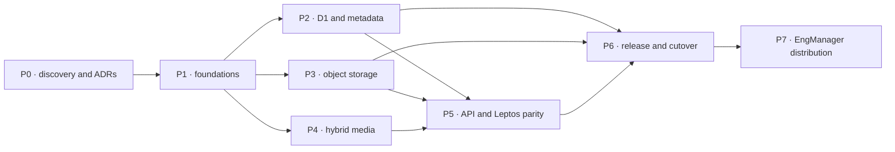

# Frame migration issue program

This directory is a dependency-ordered set of implementation-ready issue specifications for migrating Cap toward Rust, GStreamer, Cloudflare D1, R2, Media Transformations, and Leptos, then distributing Frame through the EngManager portfolio, Render, and Cloudflare. The files are written as epics: create child tasks when a deliverable needs independent ownership, but do not discard the epic's acceptance and rollout gates.

The completed, surface-by-surface shadcn-inspired Leptos/Tailwind migration is tracked separately in the nested [`UI` issue set](./UI/README.md), including the exhaustive component map and legacy-use replacements.

## Ground truth and assumptions

- Upstream is [CapSoftware/Cap](https://github.com/CapSoftware/Cap), inspected at `6ba69561ac86b8efdb17616d6727f9638015546b` on 2026-07-15.
- Cap is already substantially Rust/Tauri. The remaining program is replacement and consolidation, not a blind language rewrite.
- The pinned snapshot also contains a Next/React and TypeScript control plane, MySQL/Drizzle data, S3-compatible/Google Drive storage, and non-Rust media-service orchestration.
- Cloudflare R2 is the confirmed canonical object store. Issue 02 records the remaining S3-compatible, MinIO, BYO, self-hosting, and Google Drive compatibility decisions.
- Cloudflare Media Transformations handles capability-matched private-R2 derivatives. GStreamer remains native for capture, editing/export, long/complex work, unsupported inputs, and fallback. The separate `[stream]` managed video-library binding is not enabled.
- D1, R2, and Media bindings are Worker/Wasm capabilities. GStreamer is native. Issue 03 proves the contract and routing between those runtimes.
- The Cap checkout was a disposable research input; committed parity inventories preserve its source pins and no Cap source or checkout is required by this backlog.
- The EngManager portfolio was inspected at `matthewharwood/engmanager.xyz@1de52bc8f25793dea3697e67765d53785c05cdfa`; its committed architecture inventory is in [`docs/upstream-engmanager.md`](../docs/upstream-engmanager.md), and no portfolio checkout is required.
- `https://frame.engmanager.xyz` is the accepted public origin. A query-safe broad Cloudflare Worker Route plus strict first-segment validation owns `/api` and `/api/*`; unmatched paths go to a dedicated Render `frame-web` service. Frame never runs inside the existing portfolio process.
- The initial portfolio integration is top-level navigation with no shared cookie or request-time availability dependency. Recorder embedding is not part of the first release.

## Program flow

P2, P3, and P4 can overlap after their explicit dependencies are complete. Issue 07's walking slice should stay deliberately thin so it proves the topology before those tracks scale out.
P7 work may be proven in staging before P6 closes, but production portfolio, Render, and subdomain launch follows the P6 authority and hardening gates.

## Issue index

| ID | Phase | Issue | Depends on |
|---:|:---:|---|---|
| 01 | P0 | [Migration charter, compatibility matrix, and SLOs](./01-p0-migration-charter-parity-slos.md) | — |
| 02 | P0 | [Establish R2 and decide legacy/BYO storage compatibility](./02-p0-establish-r2-storage-target.md) | 01 |
| 03 | P0 | [Define Worker, Cloudflare Media, and native GStreamer topology](./03-p0-runtime-topology.md) | 01, 02 |
| 04 | P0 | [Parity fixtures, API snapshots, media goldens, and baselines](./04-p0-parity-fixtures-baselines.md) | 01 |
| 05 | P1 | [Rust workspace boundaries and dependency policy](./05-p1-workspace-boundaries-policy.md) | 01, 03 |
| 06 | P1 | [Shared domain types and versioned API contracts](./06-p1-shared-domain-api-contracts.md) | 01, 05 |
| 07 | P1 | [Control-plane services and media-job protocol](./07-p1-control-plane-media-job-protocol.md) | 03, 05, 06 |
| 08 | P1 | [Leptos web and Tauri desktop shells](./08-p1-leptos-web-desktop-shells.md) | 03, 05, 06 |
| 09 | P1 | [Target-specific CI and quality gates](./09-p1-ci-quality-gates.md) | 05 |
| 10 | P1 | [Reproducible local development stack](./10-p1-local-development-stack.md) | 03, 05, 09 |
| 11 | P2 | [MySQL/Drizzle to D1 schema and migrations](./11-p2-d1-schema-migrations.md) | 06, 10 |
| 12 | P2 | [D1 repositories and query conformance](./12-p2-d1-repositories-query-conformance.md) | 07, 11 |
| 13 | P2 | [Auth, sessions, OTP, API keys, and recovery](./13-p2-auth-sessions-identity.md) | 12 |
| 14 | P2 | [Organizations, RBAC, spaces, and folders](./14-p2-organizations-rbac-spaces-folders.md) | 12, 13 |
| 15 | P2 | [Video, collaboration, storage, billing, and developer metadata](./15-p2-video-collaboration-business-data.md) | 12, 14 |
| 16 | P2 | [Resumable MySQL-to-D1 ETL and reconciliation](./16-p2-mysql-d1-etl-reconciliation.md) | 04, 11–15 |
| 17 | P2 | [Shadow reads, change capture, authority, and rollback](./17-p2-shadow-dual-write-cutover.md) | 12–16 |
| 18 | P3 | [Object key contract and Cloudflare R2 adapter](./18-p3-object-storage-adapter-key-contract.md) | 02, 06, 07 |
| 19 | P3 | [Multipart upload, resume, finalize, and range access](./19-p3-multipart-upload-download.md) | 13, 18 |
| 20 | P3 | [Object backfill, integrity, and reconciliation](./20-p3-object-backfill-reconciliation.md) | 04, 18, 19 |
| 21 | P3 | [Storage security, cache, lifecycle, hold, and deletion](./21-p3-storage-security-lifecycle.md) | 14, 18, 19 |
| 22 | P4 | [Cross-platform GStreamer runtime packaging](./22-p4-gstreamer-runtime-packaging.md) | 03, 05, 09, 10 |
| 23 | P4 | [GStreamer pipeline core and state machine](./23-p4-gstreamer-pipeline-core.md) | 06, 07, 22 |
| 24 | P4 | [Cross-platform screen/window/region capture](./24-p4-screen-capture.md) | 22, 23 |
| 25 | P4 | [Microphone, system audio, camera, and A/V sync](./25-p4-audio-camera-sync.md) | 22–24 |
| 26 | P4 | [Instant Mode segmentation and live upload](./26-p4-instant-mode.md) | 18, 19, 23–25 |
| 27 | P4 | [Studio Mode recording, recovery, editing, and export](./27-p4-studio-mode.md) | 23–25 |
| 28 | P4 | [Hybrid Cloudflare Media and native GStreamer jobs](./28-p4-media-service.md) | 07, 18, 19, 22, 23, 25 |
| 29 | P4 | [Cross-executor media conformance, fault, performance, and soak suites](./29-p4-media-conformance-performance.md) | 04, 22–28 |
| 30 | P5 | [Rust API and workflow parity](./30-p5-rust-api-workflow-parity.md) | 07, 12–15, 18, 19, 28 |
| 31 | P5 | [Leptos authenticated web surfaces](./31-p5-leptos-auth-dashboard.md) | 08, 13–15, 30 |
| 32 | P5 | [Leptos share/embed player surfaces](./32-p5-leptos-share-player.md) | 08, 15, 19, 21, 30 |
| 33 | P5 | [Leptos desktop recorder/editor and accessibility](./33-p5-leptos-desktop-editor-a11y.md) | 08, 24–27, 30 |
| 34 | P6 | [Release, observability, security, backup, and DR hardening](./34-p6-operational-hardening.md) | 09, 10, 17, 21, 29–33 |
| 35 | P6 | [Progressive cutover and legacy decommission](./35-p6-progressive-cutover-decommission.md) | 04, 16, 17, 20, 34 |
| 36 | P7 | [EngManager public contract and `frame-client` crate](./36-p7-frame-client-public-contract.md) | 06, 30, 32 |
| 37 | P7 | [Portfolio integration without availability coupling](./37-p7-engmanager-portfolio-integration.md) | — (live-data child: 36) |
| 38 | P7 | [Render web runtime and Blueprint](./38-p7-render-web-runtime-blueprint.md) | 08, 09, 30, 34 |
| 39 | P7 | [`frame.engmanager.xyz` same-origin Render/Worker routing](./39-p7-cloudflare-render-same-origin-routing.md) | 07, 21, 30, 38 |
| 40 | P7 | [Protected GitHub Actions multi-runtime delivery](./40-p7-github-actions-multiruntime-delivery.md) | 09, 34, 36, 38, 39 |
| 41 | P7 | [Cloudflare infrastructure, cache, WAF, rate limits, and R2 browser policy](./41-p7-cloudflare-infrastructure-cache-security.md) | 19, 21, 32, 39, 40 |
| 42 | P7 | [Portfolio/Frame auth, browser, CSP, and embed boundaries](./42-p7-browser-auth-embed-boundaries.md) | 13, 21, 31, 32, 36, 37, 39 |
| 43 | P7 | [Cross-repository contract CI, previews, and E2E](./43-p7-cross-repo-contract-preview-e2e.md) | 36–42 |
| 44 | P7 | [Subdomain launch, observability, SLOs, and rollback](./44-p7-subdomain-launch-observability-rollback.md) | 34, 35, 37–43 |

## Phase gates

### P0 · Discovery and decisions

The capability matrix and SLOs are approved; fixture provenance is safe; R2 and legacy-storage compatibility are explicit; and the Worker/Cloudflare Media/native topology is proven with failure behavior.

### P1 · Foundations

A clean checkout has one-command local startup, green native/Wasm/desktop-oriented CI, approved crate boundaries, versioned contracts, and a synthetic create → upload → process → share walking slice.

### P2 · D1 and metadata

Every in-scope source field has a target mapping. Fresh and upgrade migrations pass. Full-scale ETL rehearsals show zero unexplained row, relationship, aggregate, or semantic mismatch. Authority fencing and a timed rollback rehearsal pass.

### P3 · Object storage

The selected providers pass one adapter contract. Private/range/multipart flows pass abuse and interruption tests. Source and destination logical object counts, bytes, roles, and verified checksums reconcile with zero unexplained differences.

### P4 · Hybrid media

Golden recordings and jobs pass the declared OS/device/codec/executor matrix within issue 01 budgets. Cloudflare Media limit, outage, cost, output-drift, and native-fallback tests pass. Injected crashes, device/network loss, and cancellation recover as specified. Hardware and software fallback pass, and long soaks remain inside resource budgets.

### P5 · API and Leptos parity

Every retained route/action/workflow has contract coverage. Critical web/share/desktop journeys pass visual, browser/device, permission, authorization, accessibility, and performance gates. Supported legacy clients remain compatible or have completed an approved deprecation.

### P6 · Production release

Signed releases and restores are proven. Security and operational reviews close. Canary SLOs and reconciliations hold for the observation window. Rollback is timed and rehearsed. Legacy authority is removed only after the irreversible go/no-go approval.

### P7 · EngManager distribution

The public `frame-client` contract passes current and last-released portfolio consumers. Frame's stateless Render service and Worker API share one Cloudflare origin with exact route/cache ownership. Protected CI produces one release per target, previews cannot mutate production, and the portfolio remains healthy during every Frame/provider fault. DNS/TLS, auth/browser boundaries, direct R2 upload, privacy/cache behavior, SLOs, and every rollback layer are tested before the portfolio link is fully launched.

## Definition of ready

An issue is ready only when:

- dependencies are closed or an approved stub is documented;
- an owner and reviewers are assigned;
- the Cap reference paths/fixtures and product disposition are known;
- acceptance criteria are observable and any performance budget comes from issue 01/04;
- security, privacy, licensing, data-migration, and rollout impact have been assessed;
- child tasks preserve all parent acceptance criteria.

## Definition of done

An issue is done only when:

- every acceptance criterion is checked with linked evidence;
- happy path, invalid input, authorization/tenant boundary, retry/idempotency, timeout/cancellation, and relevant failure recovery are tested;
- target platform/runtime coverage matches the charter;
- logs, metrics, traces, and support artifacts are useful and redact secrets/PII/media;
- migrations, compatibility notes, runbooks, and rollback controls are documented and rehearsed in proportion to risk;
- parity matrix, ADRs, API docs, and dependent issues are updated;
- no unresolved critical/high defect is hidden behind a generic follow-up.

## Cross-cutting rules

1. Preserve before replacing. Existing Cap Rust/native behavior is evaluated against parity evidence rather than discarded by default.
2. Keep runtime boundaries honest. Worker crates cannot acquire native media dependencies; media workers cannot use administrative D1 APIs as an application connection.
3. Make distributed writes idempotent. D1, queues/jobs, clients, and object storage do not share a transaction.
4. Enforce tenant policy at every boundary. Object keys, signed URLs, caches, callbacks, repositories, and UI must not become authorization bypasses.
5. Treat media as sensitive. Never put media bytes, captions, signed URLs, raw credentials, or personal data in logs or general CI artifacts.
6. Record provenance. Any implementation adapted from the Cap checkout includes source path, SHA, license, and obligations.
7. Prefer immutable/versioned artifacts. Mutable media keys and unversioned contracts complicate caches, retries, rollback, and reconciliation.
8. Roll forward safely, roll back deliberately. Every authority or durable-format change names the reversible boundary and irreversible gate.
9. Give each deployable resource one authority. Render auto-deploy, Wrangler, infrastructure-as-code, and the portfolio repository cannot race to manage the same service or zone resource.
10. Keep the portfolio independent. Frame failures may degrade a Frame-specific badge or link destination, but can never block portfolio startup, request rendering, navigation, search, shop, or checkout.
