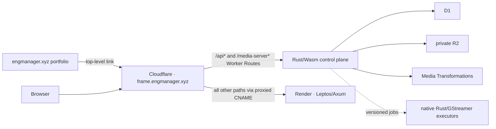

# ADR 0004: Serve Frame at `frame.engmanager.xyz` through Cloudflare and Render

- Status: accepted
- Date: 2026-07-15

## Context

The EngManager portfolio is already a Rust/Axum service on Render behind the
Cloudflare-managed `engmanager.xyz` zone. Frame needs a public Leptos web
origin, a Worker control plane with D1/R2/Media bindings, and optional native
GStreamer executors. The portfolio and Frame use different Rust toolchains,
repositories, dependency graphs, and release cadences.

Cloudflare Worker Custom Domains make a Worker the origin for an entire
hostname. Frame instead needs an external Render origin for page and asset
requests while retaining the Worker runtime for API paths. A Cloudflare Worker
Route can intercept selected paths on a proxied hostname and pass unmatched
paths to the configured external origin.

## Decision

Use `https://frame.engmanager.xyz` as Frame's one canonical public origin.
Provision a dedicated Render web service for `frame-web`; do not add Frame host
routing to the portfolio service.

Cloudflare Route patterns match the full URL, including its query string. Use
one broad `frame.engmanager.xyz/api*` route so `/api?query` cannot fall through
to Render, plus `frame.engmanager.xyz/media-server*` so the exact promoted
legacy metadata adapter remains reachable with or without a query. Because a
query-safe route must end in a wildcard, the Worker enforces the business
boundary: handle only `/api`, `/api/...`, and exact `/media-server`; return a
reviewed non-cacheable 404 for `/apix`, `/media-server/`, unpromoted children,
and other prefix lookalikes. The routes invoke `frame-control-plane` directly;
introduce a thin gateway Worker and service binding only if path normalization,
independent policy, or isolation becomes necessary. Unmatched paths continue
to Render.

`crates/frame-client` owns the versioned public browser/portfolio contract.
Its URL builder uses the single public origin and prefixes API calls with
`/api/v1`; it contains no provider SDKs or internal object/storage types.

The initial portfolio integration is an ordinary top-level navigation link.
It has no request-time availability dependency and shares no cookies with
Frame. Recorder embedding and authenticated handoff are later, explicitly
gated capabilities.

### SSR-to-Worker data boundary

Sharing a browser origin does not give the Render process D1 bindings. Render
therefore SSRs static/public shells and may make only fixed-destination,
timeout-bound anonymous reads to `/api/v1` for public metadata. Authenticated
dashboard/private-share data loads after hydration through the browser's
same-origin API call; it is not serialized into a privileged Render SSR
response. Mutations also go directly from the browser to the Worker.

The Render process receives no D1/R2 administrative credential or broad
service token. Its public SSR client cannot accept a user-controlled upstream
URL, forward arbitrary headers/cookies, follow cross-origin redirects, or log
response bodies. A Worker outage produces a generic non-sensitive/noindex
shell with bounded latency. If parity later requires authenticated SSR, a new
ADR must define the exact session proof forwarding, read-only audience,
service authentication, redaction, timeout/circuit breaker, CSRF boundary, and
failure behavior before implementation.

## Render boundary

`frame-web` is a stateless, native Rust Render web service. It builds only the
web package and its dependency graph; GStreamer must not become a dependency
of this public process. Use Render's native Rust runtime for this narrow web
service unless an evidence-backed build requirement forces Docker. Any
server-side GStreamer executor is a distinct Docker/private/background
service with its own scaling and shutdown policy.

The web process must:

- honor `PORT` by binding `0.0.0.0:$PORT`, with `FRAME_ADDR` retained as an
  explicit local/test override;
- expose cheap liveness and bounded readiness endpoints;
- validate public origin and environment configuration before readiness;
- handle `SIGTERM` and drain in-flight requests before Render's shutdown
  deadline;
- keep durable data in D1/R2, not the Render filesystem or a persistent disk;
- send direct upload flows to authorized, short-lived R2 operations instead
  of proxying media bytes through Render.

Render health checks must not turn a transient Cloudflare outage into a
restart storm. Dependency health is monitored separately from the process and
configuration checks that decide whether a new Render instance can serve.

## DNS and TLS rollout

Use this staged sequence:

1. Add exactly `frame.engmanager.xyz` to the new Render service.
2. Create `CNAME frame -> <frame-service>.onrender.com` as DNS-only and remove
   only a conflicting `AAAA` record at that hostname.
3. Verify the Render custom domain and wait for its managed public certificate.
4. Confirm direct HTTPS, then enable the Cloudflare proxy.
5. Use Cloudflare Full (strict) after the Render certificate is valid.
6. Add the broad `/api*` and narrow `/media-server*` Worker Routes together
   and verify strict raw-path handling, including query strings and lookalikes.
7. After edge policy is proven, disable the default Render subdomain to reduce
   Cloudflare-policy bypass.

No wildcard DNS record is needed. Do not change the portfolio apex, `www`, or
shop records. Audit CAA records before changing them; Render currently needs
Let's Encrypt and Google Trust Services to remain permitted.

## Cache and security boundary

Cloudflare must bypass cache for `/api`, `/media-server`, auth/session/account,
upload/finalize, health, WebSocket/SSE, mutations, private shares, and any
request carrying authorization or session cookies. Those responses also emit `no-store` or
`private` at the application boundary. Only fingerprinted immutable assets
receive a one-year immutable policy; explicitly public share HTML receives a
separate reviewed policy.

Frame cookies are host-only. Frame UI-to-API calls are same-origin, so no CORS
is needed for the normal application. A future portfolio browser API call must
use exact origins and preflight behavior. A future public-player iframe must
pair an exact portfolio `frame-src` policy with an exact Frame
`frame-ancestors` policy and versioned, origin-checked messages. The recorder
remains top-level because capture permissions should not be delegated to a
portfolio iframe.

## Deployment authority

Each target has exactly one deployment authority:

- GitHub Actions validates all targets and deploys the Cloudflare Worker with
  a protected environment and a least-privilege API token.
- Render's Git integration deploys `frame-web` only after GitHub checks pass.
- One designated `engmanager.xyz` zone-infrastructure state owns the shared
  DNS and each phase entrypoint ruleset. It is planned on pull requests and
  applied only through a protected manual production workflow; Frame and the
  portfolio never manage competing copies of a cache/WAF/rate-limit phase.
- The portfolio continues to deploy from its own repository and Render
  service.

Do not also trigger Render through a deploy hook while `checksPass` auto-deploy
is enabled. D1 changes are expand-first and the API remains compatible with
the preceding web client because a Worker release can become active before the
new Render release.

## Consequences

The browser gets one stable origin and routine Frame traffic avoids CORS. The
portfolio remains available during Frame incidents. Render and the Worker can
scale and roll back independently, and GStreamer remains out of the public web
process.

The design requires raw-URL/path-routing and cache tests because Cloudflare
owns two origins under one hostname. Releases must tolerate independent
ordering, and operators must migrate shared zone-phase rules into one authority
so DNS, Worker route, Render custom-domain, and cache-rule ownership cannot
drift across repositories or scripts.

## References

- [EngManager portfolio reference](../upstream-engmanager.md)
- [Render Cloudflare DNS configuration](https://render.com/docs/configure-cloudflare-dns)
- [Render Blueprint specification](https://render.com/docs/blueprint-spec)
- [Cloudflare Worker routing choices](https://developers.cloudflare.com/workers/configuration/routing/)
- [Cloudflare Worker Routes](https://developers.cloudflare.com/workers/configuration/routing/routes/)
- [Cloudflare Full (strict)](https://developers.cloudflare.com/ssl/origin-configuration/ssl-modes/full-strict/)
