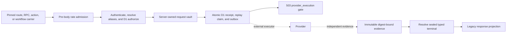

# Legacy protected integrations v1

This contract closes the local side of 45 retained Cap operations whose final
result still depends on a third-party provider. The source authority is
`CapSoftware/Cap@6ba69561ac86b8efdb17616d6727f9638015546b`; every application
profile pins an exact source path, symbol, and SHA-256.

The family includes desktop feedback/logging/plan/profile/storage/video-create,
Google Drive and S3 integration carriers, Loom routes/actions/workflows,
organization domain/storage/space/invite/seat orchestration, organization soft
delete, download-link email, Tauri release discovery, mobile active-organization
image projection, provider-only media webhooks, and video-status provider
dispatch. Analytics, NextAuth, multipart upload completion, and recording
completion are owned by other contract families.

## Trust boundary

An inserted or dequeued outbox is not evidence. Pending, dead-lettered,
unavailable, mismatched, and corrupt states fail closed. Only evidence admitted
with verifier class `independent_provider_executor`, bound to the same request,
live authority, and active executor lease permits the receipt to transition to
`verified`.

The carrier gives the exact provider request to a server-owned narrow vault.
The vault returns a randomized opaque `frame-pi-request-v1:<64 hex>` reference
and a deterministic digest of the exact typed plaintext. D1 stores that pair
and a digest-only projection of the whole caller payload; the randomized
reference never contributes to request identity. Plaintext access keys, secret
keys, OAuth codes/tokens, signed URLs, cookies, webhook bodies, email addresses,
invite lists, feedback, logs, provider JSON, and response bodies never enter D1.

Provider output follows the same boundary. Evidence stores only an opaque
`frame-pi-terminal-v1:<64 hex>` reference and its plaintext digest. A typed
terminal resolver verifies both before projecting an HTTP, JSON, or workflow
result. Terminal debug formatting is redacted, so a success body, token,
cookie, or signed URL cannot leak through logs or D1.

## Source-compatible ingress

Authentication is derived from the pinned Cap carrier rather than normalized
to one Frame-only envelope:

- desktop `withAuth` routes, mobile active-organization, profile image,
  video-create, Google Drive, S3, and the Loom HTTP import accept the source
  session or literal 36-character API-key branches;
- desktop logs preserves anonymous, session, and API-key admission;
- Google Drive callback success requires an authentic, unexpired signed state;
  provider error and missing-parameter branches return their source-shaped
  `400` HTML response before any vault, receipt, or provider intent is created;
- the Tauri release route, Loom download route/action, and download-link action
  remain public and do not fabricate a session or browser mutation grant;
- `getVideoStatus` keeps optional session identity and an independent
  collection-password policy proof instead of treating either as the other;
- media webhooks require the configured secret, compare it in constant time,
  and bind replay to the exact raw transport-body digest;
- Loom workflows accept only a protected-media or protected-integrations parent
  receipt and reload inherited authority from D1. The media workflow resolves
  `userId` through the legacy-user alias and requires it to own the target
  video. A direct import binds that owner to the parent actor; CSV import binds
  it to the selected active organization member instead of incorrectly making
  the importing manager the owner. The domain workflow resolves `cap.userId`
  to the inherited actor and resolves both `cap.orgId` and `loom.orgId` to the
  inherited tenant;
- the domain Loom parent requires the complete pinned shape: `cap.orgId`,
  `loom.userId`, `loom.orgId`, and the Loom video's id, name, and download URL;
- both create-space carriers are selector-free. They reject client
  `organizationId`/`orgId`, bind the authenticated user's trusted active
  organization, and admit an active organization member rather than inventing
  an owner/admin-only rule;
- desktop video-create treats `videoId` as an optional lookup hint. An existing
  owned video ignores `orgId` and derives its tenant from the video; an absent
  or unknown well-formed id enters new-video creation. New creation uses an
  explicit accessible organization, otherwise a valid default organization,
  otherwise the oldest active owned/member organization. It does not substitute
  the session's active organization. The desktop feature/version headers are
  reduced to canonical booleans and included in the sealed request digest
  because they change storage and upload-progress behavior.

Rate admission occurs before reading or vaulting a protected request body.
Public Loom inputs use a strict Loom host/identifier allowlist. The actively
fetched domain-workflow download URL must use HTTPS on `loom.com` or a subdomain
without user-info, an explicit port, an IP literal, or a fragment. That syntax
check is not the whole egress boundary: the executor must revalidate every
redirect hop and reject loopback, link-local, private, multicast, unspecified,
or otherwise non-public DNS results for every connection. Redirect or DNS
policy that cannot be enforced fails closed before a provider request.

## Authorization and authority freshness

Legacy source identifiers and authenticated native IDs occupy separate
domains. D1 resolves organization, space, and video aliases before comparing
them. The `legacy_protected_integration_live_authority_v1` projection then
re-authorizes credential kind/subject/key version/digest/expiry, policy proofs,
entitlement kind/subject/revision/expiry, resource revisions, and conditional
bindings at intent insertion, replay projection, and evidence admission. An
actor-supplied tenant cannot override the tenant bound to the authenticated
session or API key. Absent and cross-tenant protected resources collapse to the
carrier's same non-disclosing forbidden/not-found family.

The operation matrix freezes these authority classes:

- session or active organization membership for actor- and tenant-scoped
  desktop/mobile operations;
- owner/admin for organization domain, invitation, storage, and space changes;
- owner only for organization deletion and Stripe seat/subscription effects;
- organization owner/admin or explicit space manager for space updates;
- independent session-membership and password proofs for video status;
- verified signed state for the Google callback, constant-time secret proof for
  media webhooks, and parent-receipt authority for workflows;
- explicit public authority only for source-public carriers.

The unconditional entitlement projection retains Cap-internal, Pro,
subscription-read, and subscription-management gates. Payload-conditional
rules are also evidence-time obligations. Video-create uses exactly one
`video_existing_owner` binding when a live owned alias resolves, or exactly one
`video_new_organization_member` binding when it does not; an ignored unknown
lookup hint is not persisted as an effective target. Every finite duration
strictly greater than 300 seconds, including a fractional value such as
`300.5`, adds exactly one `video_duration_pro` binding. Those branch, tenant,
target, revision, and plan facts are rechecked at replay and evidence admission.
Space visibility/password/viewer transitions and seat quantity relative to the
live `proSeatsUsed` projection likewise cannot be authorized from stale
intent-time metadata. The live projection enforces the exact conditional kind
for each operation rather than accepting any recognized binding with the same
array length. Create-space password and Pro viewer flags bind the acting user's
plan revision. Publishing instead binds the owning organization's exact owner
user and that user's authority revision, so an authorized admin or space
manager can publish while the owner's plan remains the source-compatible gate.
Update-space preserves existing Pro viewer flags for non-Pro managers and
therefore does not invent a viewer-setting denial. `proSeatsUsed` counts
assigned active Pro-seat members and also counts a Pro owner's active membership
once when its `has_pro_seat` flag is false.

Cross-family workflow ancestry is recorded in
`legacy_protected_effect_parent_registry_v1` and
`legacy_protected_effect_parent_edges_v1`. The registry identifies the parent
family and receipt, binds its request and authority snapshot, and keeps the
child's `parent_authority_binding_digest` distinct from the child's own
authority binding. Each allowed edge declares `target_binding_rule = same` or
`child_derived`; a child therefore cannot substitute an unrelated parent or
silently inherit the wrong target. Loom children add field-level authority:
legacy actor and organization aliases must resolve to the inherited native
identity, and the media workflow's object key must remain within the exact
legacy owner/video namespace. Direct and CSV launches require
`{legacy_user_id}/{legacy_video_id}/raw-upload.mp4`; retry-processing requires
the exact live upload row's raw key for that video. `loomDownloadUrl` remains a
string field but may be empty because the pinned retry launcher passes `""` and
the current workflow never reads it.

## Replay and persistence

Migration `0062_legacy_protected_integrations_expand.sql` owns immutable
protected-integration receipts, generated replay claims, provider outbox rows,
and independent evidence, and participates in the shared protected-effect
parent registry.

Released Cap callers are never required to send an invented
`Idempotency-Key`. Ordinary routes, RPCs, and actions atomically claim
`(source operation, principal digest, request digest)` using a server-generated
receipt nonce. Pending work stays reachable; a terminal claim can roll forward
only after the bounded 15-minute retention window. Signed webhook deliveries
derive their natural replay identity from the operation and exact transport
body digest. Loom workflows derive it from their source identifiers, including
the domain workflow attempt (default `0`). The media workflow additionally
includes its exact parent family, receipt, and request digest: duplicate
delivery from one parent is idempotent, while a newly admitted retry parent can
start a new run for the same video.

Natural identities are globally unique per operation and replay digest, not
per credential principal. Rotating a browser/API credential cannot duplicate a
domain Loom workflow, and rotating the signed-endpoint key cannot duplicate an
already observed webhook body. Generated request-digest claims remain
principal-bound because their identity intentionally represents one caller's
in-flight continuation rather than a provider/workflow natural key.

The fixture's `required`, `optional`, and `forbidden` idempotency values preserve
the pinned operation's effect/retry policy; they are not a new public HTTP
header contract. A replay whose natural identity is reused with different
request material is a conflict. Receipt, claim, outbox, evidence, registry, and
edge invariants are enforced in D1 so an application retry cannot bypass them.

## Carrier integration checklist

The local integration must preserve these mechanical bindings:

1. Export `legacy_protected_integrations` from `crates/application/src/lib.rs`.
2. Declare `legacy_protected_integrations_runtime` and
   `legacy_protected_integrations_web_runtime` in
   `apps/control-plane/src/lib.rs`.
3. Map the 20 exact HTTP routes in
   `fixtures/api-parity/v1/protected-integrations.json` to
   `legacy_protected_integrations_web_runtime::route_response` with their
   operation IDs. The two parameterized routes require exact template matching,
   not prefix admission.
4. Delegate `OrganisationSoftDelete` from the Effect-RPC carrier to
   `rpc_response`.
5. Delegate the 22 listed server-action IDs to `server_action_response`, while
   preserving each source operation's public/session policy. Replay material is
   generated internally; no new client header or flow token is introduced.
6. Point both Loom workflow schedulers at `workflow_response` with an admitted
   cross-family parent receipt before any provider execution.
7. Keep all 45 IDs in the compatibility registry's locally proven/enabled exact
   lists and keep the fixture, source family, modules, migration, queries, and
   conformance script registered as local adapter evidence.
8. Run
   `python3 -I scripts/ci/legacy-protected-integrations-sqlite-conformance.py`
   in the parity workflow and retain its artifact.
9. Keep the protected `provider_execution` promotion gate. Production requests
   remain fail-closed until the request vault, exact credential/state policy
   adapters, parent loader, external executor, and terminal resolver are
   explicitly configured and evidence is admitted.

The complete operation/authority/provider matrix is the checked fixture
`fixtures/api-parity/v1/protected-integrations.json`; duplicating its 45 rows
here would create a second source of truth.

## Verification

`scripts/ci/legacy-protected-integrations-sqlite-conformance.py` proves the
exact 45-ID inventory against the parity report, verifies pinned Cap source
hashes when `.tmp/cap` is available, applies every migration, and exercises
alias resolution, credential and authority freshness, secret exclusion,
transaction rollback, generated and natural replay, cross-family ancestry,
credential-rotation uniqueness, field-level workflow identity and raw-key
binding, valid empty Loom retry input, egress URL rejection, selector-free
create-space, the complete Loom parent schema, video-create existing/new/default
organization branches and exact conditional kinds, evidence mismatch,
sealed-terminal projection, immutability, and foreign-key integrity. Rust tests
independently cover source auth profiles, request-vault binding, strict Loom
inputs, header-derived video-create request identity, and typed terminal
resolution; the ingress keeps callback error branches ahead of staging. Neither
suite fabricates provider success from a staged intent.
