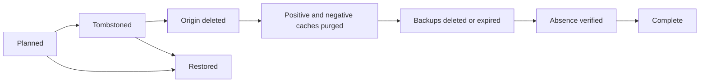

# Storage lifecycle v1

## Invariants

- Every object identifier is canonical, bounded, tenant scoped, and redacted from `Debug` output.
- Content is immutable. A new source, derivative, privacy state, or cache behavior receives a new
  revision or cache generation; an existing key is never overwritten in place.
- Export, hold, restore, deletion, and erasure use the versioned lifecycle manifest, not a provider
  list or a prefix guess.
- Retention and legal hold are checked both when deletion is planned and before every destructive
  transition.
- Every deletion transition is ordered, idempotent, inventory-bound, and evidence-bound.
- Completion evidence contains counts and cryptographic digests, not object keys or media data.

## Cache and privacy transition

`CacheInvalidationPlan::privacy_change` accepts only `old generation + 1`. It binds the tenant,
object, old/new generation, change time, and deadline into a cache-tag digest. Both successful
responses and cached misses must be purged. Application authorization rejects the old generation
immediately, independently of edge propagation.

A privacy change is complete when:

1. application reads reject the old generation;
2. positive and negative cache variants report purge completion;
3. the verified custom-domain path and signed route observe the new state;
4. all observations finish before the configured deadline.

The Worker adapter executes both purge and subsequent positive/negative absence probes before it
persists completion. Local tests prove construction, authorization, forged-receipt rejection, and
deadline enforcement; only a deployed provider rehearsal can establish real edge propagation time.

## Retention, hold, restore, and deletion

Planning fails while any manifest object has unexpired retention or a matching legal hold is active.
A hold activated during execution blocks the next destructive transition. Releasing the exact hold
allows a deterministic retry. Restore is idempotent from planned/tombstoned state and is allowed
through the seven-day boundary. Before reactivating metadata, the provider adapter must observe every
manifest-bound origin and backup object at its exact size and checksum. This makes a crash after
provider deletion fail closed instead of falsely restoring missing bytes. A workflow cannot use the
normal restore path after durable origin-deletion evidence.

Each stage's expected evidence digest includes the immutable inventory digest, a stage code, and the
exact stage target set. Origin deletion excludes backup-copy roles; backup deletion includes only
backup-copy roles; tombstone, cache purge, and verification bind every manifest object. Arbitrary or
replayed evidence from another inventory is rejected.

`ErasureProof` is available only after every stage. It records schema version, correlation ID, tenant,
inventory digest, object count, completion time, and the evidence-chain root. It intentionally omits
object identifiers, checksums, titles, users, domains, and provider response bodies.

## Export

`StorageExportPlan::from_manifest` snapshots every manifest object except ephemeral multipart state.
The plan binds tenant, inventory digest, exact targets, and checksums. An inventory change invalidates
the plan. Legal hold does not remove the owner's right to export; authorization and audit still apply.

## Quota

Quota reservation checks current bytes, reserved bytes, object count, JSON/D1-safe integer limits,
and overflow before any upload grant is issued. Provider-side quota remains a second independent
guard. A provider denial cannot be translated into a larger local allowance.

## Audit

Governance audit events contain only safe action/outcome codes and resource digests. Sequence,
timestamp, resource digest, and previous-event digest are length-framed and SHA-256 hashed. The chain
rejects out-of-order timestamps, unsafe codes, and excessive length. D1 persists tenant-scoped,
append-only records with immutable update/delete triggers and compare-and-swap chain heads. Deployed
reconciliation must still verify the complete chain against protected provider observations.
