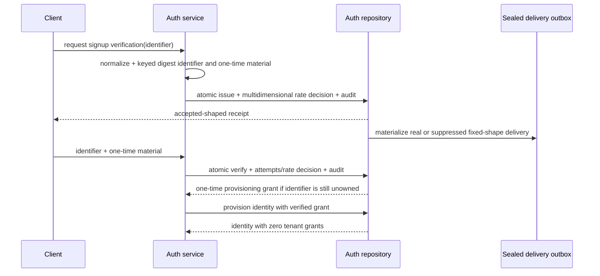
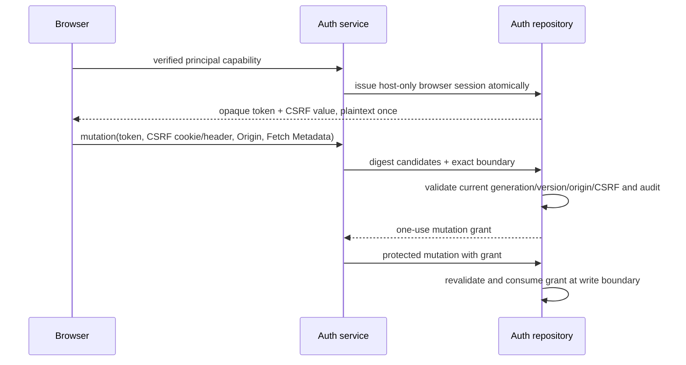
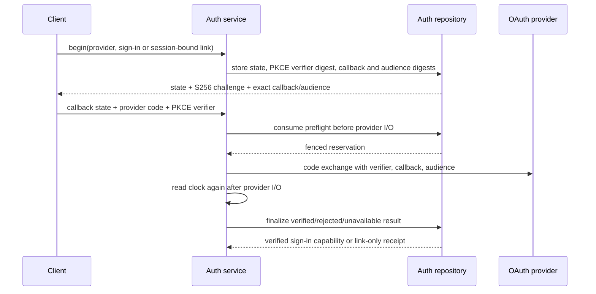

# Authentication protocol and threat model

This document defines the runtime-neutral authentication contract implemented by
`frame-domain`, `frame-ports`, and `frame-application`. It is the security baseline for browser,
desktop, mobile, extension, OAuth, verification, recovery, and developer API clients.

The current proof covers the domain/application state machines and the in-memory conformance
adapter. It does **not** make that adapter a production store, complete the D1 adapter, send real
email, migrate a legacy session, or authorize a production cutover. Those gates remain explicit.

## Trust and authority boundaries

- A caller never becomes a principal by presenting a caller-constructed `PrincipalSnapshot`.
  Session issuance consumes a repository-minted, expiring, one-time issuance grant or a
  repository-revalidated current-session mutation grant.
- Signup verification can mint only a one-time provisioning grant bound to one verified,
  currently unowned identifier, user ID, identity revision, and expiry. Provisioning creates an
  identity with no tenant grants. Organization authority is a separate workflow.
- Account linking is a mutation, not a login. OTP and OAuth link continuations are bound to the
  originating session ID, user ID, and generation; logout, logout-all, rotation, and recovery
  purge them. Successful completion returns `Linked`, never a fresh login capability.
- Browser mutations require the host-only session credential, exact configured origin,
  compatible Fetch Metadata, and matching CSRF cookie/header digests. The repository mints a
  one-use mutation capability only after all checks pass.
- Desktop, mobile, and extension sessions are bearer credentials distinguished by client kind.
  Their transport adapters must use operating-system protected storage and must not downgrade a
  browser request into a non-browser client to bypass the browser boundary.
- Developer API keys are tenant- and scope-bound. Issuance/revocation requires a validated browser
  mutation capability and an authoritative owner/admin tenant grant.
- Provider assertions are accepted only after an OAuth state/PKCE/redirect/audience preflight and
  provider exchange. Finalization re-reads time after provider I/O and atomically consumes the
  repository reservation.

## Protocol flows

### Signup and verification

Known and unknown identifiers perform the same issue-side hashing, sealing, durable enqueue, rate,
and audit work. Suppressed deliveries are cleaned before dispatch and never mint a principal.
Verification secrets, destinations, and sealed payloads are redacted from generic formatting.

### Browser session and mutation

The cookie contract is `__Host-frame_session`, `Secure`, `HttpOnly`, host-only, path `/`, and
`SameSite=Lax`. Transport adapters must emit it exactly and must apply `no-store` to auth responses.

### Native and extension clients

Desktop, mobile, and extension clients use the same opaque-session lifecycle without browser CSRF
state. A transport adapter records the exact `AuthClientKind`, sends credentials only to the exact
Frame origin, and treats device loss as logout/revocation. Adding a new client kind requires a
threat-model update; callers cannot select a weaker kind for a browser mutation.

### OAuth sign-in and account linking

Authorization codes are provider-controlled visible ASCII, percent-decoded exactly once at the
callback boundary, bounded to 2,048 bytes, and always redacted. The callback adapter must preserve
`+` as data rather than apply form-urlencoded space folding. PKCE is S256 only.

## Threat/control matrix

| Threat | Required control |
| --- | --- |
| Session fixation or token replay | Repository-minted random values; hashed durable state; generation rotation; rotated-family replay revocation |
| Logout/recovery bypass | Session-version bump and revocation; pending link continuation purge; final write-boundary revalidation |
| CSRF or sibling-subdomain request | Host-only cookie, exact origin, Fetch Metadata, double-submit CSRF digest, one-use mutation grant |
| Identifier enumeration | Same public issue receipt and equivalent sealed/durable work for known, unknown, and already-owned targets |
| OTP brute force | Expiry, attempt lock, global/source/device/identifier limits, fixed bucket cap and TTL collection |
| Rate-state memory exhaustion | Global bucket first; denial short-circuits attacker-controlled dimensions; 4,096-bucket hard cap |
| Account-link persistence | Originating session binding; purge on logout/logout-all/recovery/rotation; `Linked` result only |
| Signup privilege escalation | Grant bound to verified unowned identifier; atomic one-time consume; identity starts with no tenant grants |
| OAuth interception/replay | State, S256 PKCE, exact server callback/audience, preflight before exchange, one-time reservation |
| Provider outage confusion | Distinct privacy-safe `AdapterFailure` audit reason and unavailable public result |
| Secret leakage | Redacted secret types, sealed delivery, stable public errors, repository secret scanner |
| Hash-key rotation bypass | Active/fallback candidates are matched together and old rate histories merge into the active bucket |

## Audit contract

Every repository authentication decision and mutation commits its audit event in the same adapter
transaction. Events contain a correlation ID, stable action/outcome/reason codes, optional opaque
user/session IDs, client kind, and timestamp. They never contain raw identifiers, credentials,
OAuth codes, OTPs, cookies, provider messages, or delivery ciphertext.

## Legacy compatibility and staged reauthentication

No existing Cap session is silently declared compatible. Before migration, the source-session
inventory must classify digest format, absolute/idle expiry, rotation state, client kind, cookie
scope, and session-version semantics.

If compatible, a temporary legacy validator may run behind a per-client kill switch. A valid
legacy credential can mint one constrained migration grant, which atomically creates a Frame
session with an expiry no later than the legacy absolute expiry and marks the source credential as
migrated. Replays, revoked versions, ambiguous client kinds, and sibling-domain cookies fail.

If any required property cannot be preserved, the release must use an approved forced-login plan:
announce the affected clients and date, revoke legacy authority, retain recovery capacity, measure
login/recovery failures, and keep a rollback that restores only the previous validator—not two
simultaneous session writers.

## Production adapter requirements

The D1 implementation must preserve the same atomic outcomes, capability records, audit coupling,
bounded rate state, outbox leases, and continuation fencing. It must add query/fault conformance,
contention handling, encrypted delivery envelopes, a CSPRNG secret source, real provider adapters,
and migration evidence. Until those pass, this protocol is an implemented core contract rather
than production authentication authority.
