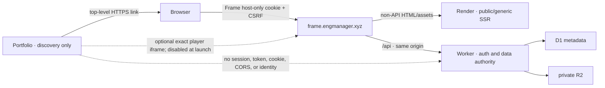

# Portfolio and Frame browser trust boundaries

`engmanager.xyz` and `frame.engmanager.xyz` are mutually untrusted origins even
though browsers classify them as same-site. The launch integration is a normal
top-level link with no shared cookie, local storage, bearer token, identity,
CORS privilege, or request-time availability dependency.

## Sessions, mutations, and redirects

The browser cookie contract is exactly `__Host-frame_session`, path `/`,
`Secure`, `HttpOnly`, host-only, and `SameSite=Lax`. No `Domain` attribute is
permitted. Rotation changes generation and invalidates the old family; logout,
logout-all, recovery, and replay revoke relevant sessions and pending account
links. Auth responses are `no-store`.

SameSite is not CSRF protection against a sibling. Every browser mutation must
present the current session, matching CSRF cookie/header digests, the exact
Frame Origin, and `Sec-Fetch-Site: same-origin` (or an explicitly modeled
non-browser client). The repository mints and consumes a one-use mutation
grant at the write boundary. Missing/null/cross/same-site origins fail closed.

Post-auth redirects use `SafeReturnPath`: a bounded relative path from the
authenticated route inventory. Schemes, protocol-relative URLs, userinfo,
queries/fragments, backslashes, controls, traversal, nested paths, unknown
routes, and arbitrary resource IDs fail. OAuth callback origins/paths are
separately exact and reject ports, Unicode/punycode ambiguity, percent encoding,
query, fragment, dot segments, and nested URLs.

The domain/application OAuth contract implements one-use state, S256 PKCE,
audience, callback digest, TTL, replay storage, and post-provider revalidation.
No portfolio handoff route or provider adapter is enabled for launch. Enabling
handoff requires an independent feature flag, provider evidence, and a
portfolio implementation; codes never enter analytics/referrers/logs.

## SSR, CORS, and cache

Render may fetch only fixed `/api/v1` anonymous public DTOs with the bounded
`frame-client`. It never forwards a cookie/authorization header or renders
private/authenticated DTOs. Authenticated routes use generic no-store shells
and browser same-origin hydration. Failure produces the same generic shell.

Normal Frame UI/API traffic has no CORS. Direct portfolio browser API access is
disabled. If introduced, each endpoint needs an exact origin/method/header/
credentials matrix, `Vary: Origin`, safe OPTIONS/errors, and no wildcard.
Private/auth/API/embed state is no-store at origin and edge.

## Framing and messages

Top-level, recorder, dashboard, auth, and account routes enforce
`frame-ancestors 'none'`, `X-Frame-Options: DENY`, no-referrer, and a Permissions
Policy denying display capture, camera, microphone, and other sensitive APIs.
The public embed route is off in production. When explicitly enabled, it omits
XFO only for that route, allows exact configured ancestor origins, remains
no-store, and grants playback/fullscreen/PiP—not capture.

Embed commands use versioned, deny-unknown-field envelopes bound to exact
origin, the parent source window, public share ID, monotonic nonzero sequence,
closed command variants, bounded seek, and closed playback rates. Replies use
an independent schema and contain only coarse player state. Origin, source,
schema, share, replay, oversize/unknown, and confused-deputy failures are
ignored without private data.

## CSP reporting privacy

Enforcing CSP reports to a bounded same-origin endpoint. Both legacy and
Reporting API bodies are capped by the 16 KiB server limit and eight reports.
The collector discards document/blocked URLs, source files, samples, referrer,
policy text, and body. It retains only safe release ID, directive class,
blocked-resource class, and report/enforce disposition. Invalid bodies return
an empty accepted response and are never echoed.
