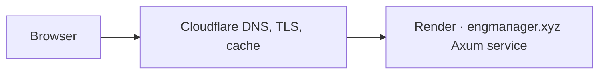

# EngManager portfolio integration reference

Frame uses a shallow, ignored checkout of
[`matthewharwood/engmanager.xyz`](https://github.com/matthewharwood/engmanager.xyz)
in `.tmp/engmanager.xyz` as the integration reference. The design and backlog
were researched against commit
`1de52bc8f25793dea3697e67765d53785c05cdfa` on 2026-07-15.

Recreate the checkout with:

```sh
mkdir -p .tmp
git clone --depth 1 https://github.com/matthewharwood/engmanager.xyz.git .tmp/engmanager.xyz
```

The checkout is a reference, not a vendored dependency. Frame and the
portfolio remain independently deployable repositories with separate release
cadences and rollback controls.

## What the portfolio is today

The pinned snapshot is a single-member Rust workspace whose `website` binary
uses Axum 0.8, Tokio, `eng-markup`, embedded/minified assets, Tantivy search,
Stripe, and a background Discord client. It is pinned to
`nightly-2026-05-08`; Frame is pinned independently to Rust 1.96.1. The two
repositories must not share a target directory, lockfile, or toolchain policy.

Production is one stateless Render web service behind Cloudflare:



The portfolio already contains useful operational patterns:

- `website/src/config.rs` reads Render's `PORT` and binds
  `0.0.0.0:$PORT`, while local development defaults to
  `127.0.0.1:3000`.
- `website/src/main.rs` handles `SIGTERM` and shuts Axum down gracefully.
- `website/src/http.rs` separates public cacheable HTML from `no-store`
  responses and emits CSP, Permissions Policy, and other security headers.
- `website/src/router.rs` centralizes routes, host dispatch, middleware, and
  response-contract tests.
- `scripts/render-shop-domain.sh` demonstrates an idempotent Render custom
  domain API call.
- `scripts/cloudflare-bootstrap.sh` demonstrates idempotent DNS and Cache
  Rules API calls, and `scripts/purge-cache.sh` demonstrates cache purge.
- `_docs/shop-subdomain-runbook.md` explicitly recommends a separate Render
  service when a subdomain has its own runtime, data, or release cadence.

There is no `render.yaml`, Dockerfile, Procfile, or GitHub Actions workflow in
the pinned portfolio snapshot. Its README documents `cargo build --release`
and `./target/release/website` as the Render commands. The root workspace
`Cargo.lock` is also ignored by the current `.gitignore`; a portfolio change
that adds `frame-client` must correct that and commit the resolved lockfile.

## Integration constraints found in the code

### Keep Frame on a separate Render service

The portfolio recognizes only portfolio and shop/store hosts. Pointing
`frame.engmanager.xyz` at the existing `engmanager-xyz.onrender.com` service
would render the portfolio homepage or a portfolio 404, not Frame. Frame also
has an independent Leptos application, Cloudflare Worker, D1/R2/Media
bindings, and optional native GStreamer workers. Those are sufficient reasons
to provision a separate Render service.

The public topology is defined in
[ADR 0004](./adr/0004-engmanager-render-cloudflare-topology.md): Cloudflare
uses a broad `/api*` Worker Route plus strict first-segment validation to own
`/api` and `/api/*` on `frame.engmanager.xyz`, and proxies every other path to
the Render-hosted Leptos/Axum service.

### Start with top-level navigation

The lowest-risk portfolio integration is a link or project card pointing to
`https://frame.engmanager.xyz/`:

- `website/src/pages/homepage.rs` owns the homepage project/card content.
- `website/src/components/nav/mod.rs` owns the shared article/search nav.
- `website/js/src/nav-router.js` deliberately leaves cross-origin navigation
  to the browser.
- `website/js/src/sw.js` ignores cross-origin requests, so the portfolio
  service worker will not capture Frame traffic.

Frame downtime must never prevent the portfolio from starting or rendering.
If a public status badge is later added, reuse the timeout-bound, last-known-
good background snapshot pattern in `website/src/discord.rs`; never perform a
Frame network request in a portfolio request handler.

### Do not embed the recorder in the first release

The portfolio currently emits a report-only CSP whose `frame-src` does not
include Frame and whose `media-src` is self-only. Its Permissions Policy
disables camera, microphone, display capture, and autoplay, and limits
fullscreen to self. A recorder iframe would therefore be both broken and an
unnecessary permission boundary.

Initial recording, authentication, and dashboard use must navigate to Frame
as a top-level page. A later public-player embed may be enabled only on
explicit routes with:

- an exact portfolio `frame-src` allowlist;
- an exact Frame `frame-ancestors` allowlist;
- a minimal iframe `allow` policy;
- origin-checked, versioned `postMessage` events; and
- tests proving private metadata, cookies, signed URLs, and object keys do not
  cross the boundary.

The portfolio's `X-Frame-Options: DENY` protects portfolio responses; it does
not prevent the portfolio from embedding a different origin.

### Keep auth and cookies host-local

The portfolio does not currently have a general login/session system. The
first integration therefore has no shared login. Frame sessions must use
host-only `Secure`/`HttpOnly` cookies and must not set
`Domain=.engmanager.xyz`. If a signed-in handoff is later required, use an
authorization-code/PKCE flow or a one-time, short-lived signed exchange with
an exact return-URL allowlist. Never put bearer or R2 credentials in a URL.

Because Frame's UI and API share `frame.engmanager.xyz`, normal Frame browser
traffic is same-origin. Direct browser calls from the portfolio are a separate
feature and require exact CORS origins, `Vary: Origin`, safe preflight handling,
and a CSRF model; they are not needed for a link or server-side public-health
poll.

### Keep caches and sitemaps separated

The portfolio emits one-hour shared-cache HTML with a stale window. Only
public, non-user-specific Frame summaries may enter that HTML. Private video
state, signed R2 URLs, user identity, and session data are always `no-store`.

The apex sitemap should continue to contain apex URLs. Frame owns its own
canonical URLs, robots policy, and sitemap on `frame.engmanager.xyz`. Cache
purges must be host/URL/tag scoped; Frame deployment must never use the
portfolio's zone-wide purge fallback.

## New shared client boundary

Issue 36 specifies `crates/frame-client`, a small public-contract crate in the
Frame repository. The portfolio consumes a pinned Frame Git revision, just as
it already pins `auteur-rs`, while Frame never depends on the portfolio.

The crate owns versioned public DTOs, validated origin/URL construction,
structured errors, optional timeout-bound HTTP transport, contract fixtures,
and redaction. It deliberately does not depend on Leptos, Axum, Worker APIs,
GStreamer, D1, R2, or internal Frame domain/storage types. A static portfolio
link does not require a runtime call; the client exists for public health and
approved public-share metadata without duplicating wire formats.

## Provider references

- [Render web services and `PORT`](https://render.com/docs/web-services)
- [Render Blueprint specification](https://render.com/docs/blueprint-spec)
- [Render health checks](https://render.com/docs/health-checks)
- [Render deploy and graceful-shutdown lifecycle](https://render.com/docs/deploys)
- [Render default environment variables](https://render.com/docs/environment-variables)
- [Render Preview Environments](https://render.com/docs/preview-environments)
- [Render custom domains](https://render.com/docs/custom-domains)
- [Render's Cloudflare DNS sequence](https://render.com/docs/configure-cloudflare-dns)
- [Cloudflare Worker Routes](https://developers.cloudflare.com/workers/configuration/routing/routes/)
- [Cloudflare Full (strict) TLS](https://developers.cloudflare.com/ssl/origin-configuration/ssl-modes/full-strict/)
- [Cloudflare cache behavior](https://developers.cloudflare.com/cache/concepts/cache-control/)
- [Cloudflare Ruleset Engine phases](https://developers.cloudflare.com/ruleset-engine/about/phases/)
- [Cloudflare R2 presigned URLs](https://developers.cloudflare.com/r2/api/s3/presigned-urls/)
- [Cloudflare R2 CORS](https://developers.cloudflare.com/r2/buckets/cors/)
- [Cloudflare Workers deployment with GitHub Actions](https://developers.cloudflare.com/workers/ci-cd/external-cicd/github-actions/)
- [Cloudflare Workers Builds Git integration](https://developers.cloudflare.com/workers/ci-cd/builds/git-integration/)
- [GitHub deployment environments](https://docs.github.com/en/actions/reference/workflows-and-actions/deployments-and-environments)
